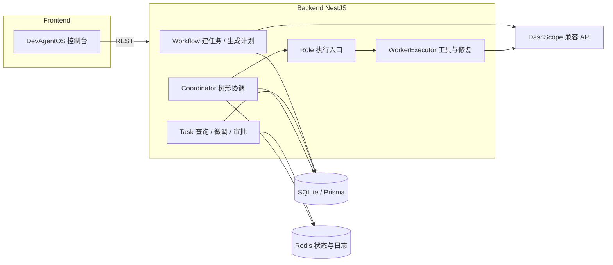

# DevAgentOS

面向开发与自动化的 **AI 任务编排控制台**：创建需求 → LLM 生成工作流计划 → 人工审批 → 协调器按任务树调度 → **Worker** 执行（读文件、跑命令、修复重试等），状态与日志落在 **SQLite + Redis**。

根目录 `package.json` 中工作区名为 `ai-orchestrator`；前端展示为「DevAgentOS 控制台」。

## 仓库结构（pnpm workspace）

```
DevAgentOS/
├── apps/
│   ├── backend/          # NestJS API、Prisma、Worker、协调与审批
│   └── frontend/         # React + Vite 控制台（任务列表、计划/执行审批、详情与日志）
├── packages/
│   └── shared/           # @ai-orchestrator/shared — Task 类型、RiskLevel 等跨端契约
├── package.json
└── pnpm-workspace.yaml
```

| 包 | 说明 |
|----|------|
| `apps/backend` | NestJS 11、Prisma 6（SQLite）、ioredis；全局 CORS、ValidationPipe |
| `apps/frontend` | React 19、React Router 7、Vite 6；`@shared` 指向 `packages/shared` |
| `packages/shared` | 仅 TypeScript 构建产物，供 backend 与 frontend 引用 |

## 技术栈概览

- **运行时**：Node.js；包管理 **pnpm 8**（见根目录 `packageManager`）
- **后端**：NestJS、Prisma、Redis（任务状态缓存与执行日志流）
- **前端**：Vite + React，`VITE_API_BASE` 指向后端根地址
- **LLM**：默认接入阿里云 **DashScope** OpenAI 兼容 Chat Completions（通义千问）；未配置 API Key 时，计划生成可走规则 fallback，不阻塞建任务

## 环境要求

- Node.js（与当前 lockfile 兼容的版本，建议 LTS）
- **pnpm**（版本与根 `packageManager` 一致为佳）
- **Redis**（默认 `redis://127.0.0.1:6379`）
- 可选：配置 `DASHSCOPE_API_KEY` 以使用完整 LLM 工作流规划能力

## 快速开始

### 1. 安装依赖

在仓库根目录：

```bash
pnpm install
```

### 2. 后端环境与数据库

```bash
cd apps/backend
cp .env.example .env
# 按需编辑 .env（尤其 DATABASE_URL、REDIS_URL、DASHSCOPE_API_KEY）
pnpm prisma:generate
pnpm prisma:migrate
```

`DATABASE_URL` 使用相对路径时，**相对于 `prisma/schema.prisma` 所在目录**。示例推荐使用 `file:./dev.db`，数据库文件位于 `apps/backend/prisma/dev.db`；若误写为 `file:./prisma/dev.db` 会生成嵌套路径，易误以为「库没建好」。

### 3. 前端环境

```bash
cd apps/frontend
cp .env.example .env
# 将 VITE_API_BASE 设为与后端一致，例如 http://127.0.0.1:3000
```

局域网访问时：Vite 已 `host: true`，请把 `VITE_API_BASE` 改为本机局域网 IP + 端口，而不是 `127.0.0.1`。

### 4. 启动开发服务

**终端 A — 后端**（会先构建 `shared`）：

```bash
# 在仓库根目录
pnpm dev:backend
```

**终端 B — 前端**：

```bash
pnpm dev:frontend
```

默认后端端口：`PORT` 未设置时为 **3000**（与 `main.ts` 一致）。前端默认回退到 `http://127.0.0.1:3000`，请与 `PORT` 对齐。

### 5. 生产构建

```bash
pnpm build:backend
pnpm build:frontend
```

后端生产启动：`apps/backend` 下 `pnpm start:prod`（`node dist/main`，需已 `build` 且 Prisma 已生成）。

## 架构与数据流（简图）



## 后端模块说明

| 模块 | 职责 |
|------|------|
| **WorkflowModule** | `POST /task/create` 仅创建主任务（CREATED）；`POST /workflow/generate/:taskId` 对主任务调用 LLM 生成子任务与计划，进入待审计划状态 |
| **TaskQueryModule** | 任务列表、详情、日志、状态 PATCH、删除、重跑失败、追加子任务、微调版本与激活等 |
| **TaskApprovalController** | 待审计划列表与通过/驳回；待审批执行列表与通过/驳回 |
| **CoordinatorModule** | `POST /coordinator/run/:taskId` 按树推进子任务执行（与 Role 协作） |
| **RoleModule** | `POST /role/execute/:taskId` 对单任务执行 Worker 流水线；内部依赖 **WorkerModule** |
| **WorkerModule** | `WorkerExecutorService`、工具执行、多类 **RepairSkill**（配置错误、路径沙箱、测试断言等）与 **RepairEngine** |
| **RedisInfraModule** | 任务 Redis 封装（状态、执行步骤日志等） |
| **PrismaModule** | 全局 Prisma 客户端 |

业务上典型顺序：**创建任务** → **生成计划**（需 `parameters` 中含非空 `taskDescription` 等，见下）→ **审批计划** → **协调 run** 或按节点 **role/execute** → 中间可能经过 **WAITING_APPROVAL** 等人审状态（以控制器与服务逻辑为准）。

## HTTP API 摘要

全局前缀：无（根路径即下列路径）。下列均为相对后端的 path。

**任务与计划**

| 方法 | 路径 | 说明 |
|------|------|------|
| POST | `/task/create` | 创建主任务，`body: { name, parameters? }` |
| POST | `/workflow/generate/:taskId` | 为主任务生成执行计划（子任务） |
| GET | `/task/list` | 根任务列表 |
| GET | `/task/:id` | 任务详情 |
| GET | `/task/:id/logs` | 任务日志（Redis） |
| PATCH | `/task/:id` | 更新可编辑字段 |
| PATCH | `/task/:id/status` | 更新状态 |
| DELETE | `/task/:id` | 删除根任务及子任务、版本等 |
| POST | `/task/:id/rerun` | FAILED → 重置并重跑 |
| POST | `/task/:id/append` | 追加子任务并触发协调 |
| POST | `/task/refine/:taskId` | 任务微调草稿（COMPLETED） |
| POST | `/task/version/activate/:versionId` | 激活版本写回 parameters |
| GET | `/task/:taskId/versions` | 版本列表 |
| POST | `/task/refine/:taskId/execute` | 微调后同任务重跑 |

**审批**

| 方法 | 路径 | 说明 |
|------|------|------|
| GET | `/task/pending-plan-approval` | 待审计划 |
| POST | `/task/approve-plan/:id` / `reject-plan/:id` | 计划通过/驳回 |
| GET | `/task/pending-approval` | 待审批执行 |
| POST | `/task/approve/:id` / `reject/:id` | 执行通过/驳回 |

**执行与协调**

| 方法 | 路径 | 说明 |
|------|------|------|
| POST | `/coordinator/run/:taskId` | 协调执行子树 |
| POST | `/role/execute/:taskId` | 对指定任务执行 Worker |

## 环境变量（后端）

复制自 `apps/backend/.env.example` 并补充说明：

| 变量 | 说明 |
|------|------|
| `PORT` | HTTP 端口，默认 `3000` |
| `DATABASE_URL` | Prisma SQLite，如 `file:./dev.db`（路径相对 prisma 目录） |
| `REDIS_URL` | Redis 连接串，默认 `redis://127.0.0.1:6379` |
| `WORKSPACE_ROOT` | 可选；Worker 文件工具沙箱根目录，默认推向 monorepo 根 |
| `DASHSCOPE_API_KEY` / `QWEN_API_KEY` | 二选一；LLM 鉴权（Worker 与 Workflow LLM 均可能使用） |
| `LLM_MODEL` | 默认 `qwen-turbo` |
| `LLM_BASE_URL` | 默认 DashScope 兼容 Chat Completions URL |
| `LLM_REQUEST_TIMEOUT_MS` | 单次请求超时，默认 120000，限制在 30s～900s |
| `LLM_STREAM` | `1`/`true`/`on` 等开启流式补全 |
| `LLM_RAW_LOG_MAX_CHARS` | 写入 Redis 的 LLM 原文最大长度；`0` 或未设置表示不截断 |
| `REPAIR_MAX_ATTEMPTS` | Worker 侧修复尝试次数上限，默认 `3` |

前端仅常用：

| 变量 | 说明 |
|------|------|
| `VITE_API_BASE` | 后端 API 根 URL，无尾斜杠 |

## 任务状态（Prisma `TaskStatus`）

含：`CREATED`、`PLAN_GENERATED`、`WAITING_PLAN_APPROVAL`、`PLAN_APPROVED`、`PENDING`、`WAITING_APPROVAL`、`RUNNING`、`WORKER_PAUSED`、`COMPLETED`、`FAILED` 等。主任务从「仅需求」到「生成子任务待审」再到执行，由服务与审批接口共同约束；详见 `apps/backend/prisma/schema.prisma` 中注释。

## 共享包 `@ai-orchestrator/shared`

- 导出见 `packages/shared/src/index.ts`（如 `Task`、`TaskStatus`、`RiskLevel`）。
- 修改后需重新 `pnpm build:shared` 或依赖它的 `prebuild` 链。

## 根目录脚本

| 脚本 | 作用 |
|------|------|
| `pnpm build:shared` | 构建 shared |
| `pnpm dev:backend` | 构建 shared 后启动 backend 开发（watch） |
| `pnpm dev:frontend` | 启动 Vite 开发服务器 |
| `pnpm build:backend` | 构建 backend |
| `pnpm build:frontend` | 构建 frontend |

各 app 目录下另有 `lint`、`test`（backend）等，以各 `package.json` 为准。

## 测试

```bash
cd apps/backend
pnpm test
pnpm test:e2e
```

## 许可

子项目 `apps/backend` 的 `package.json` 标注 `UNLICENSED`；仓库根未包含独立 LICENSE 文件。对外分发前请自行补充许可证与版权声明。

---

**文档版本**：与当前仓库结构一致；若模块或路由有变，请以 `apps/backend/src` 下 Controller 与 `package.json` scripts 为准。
